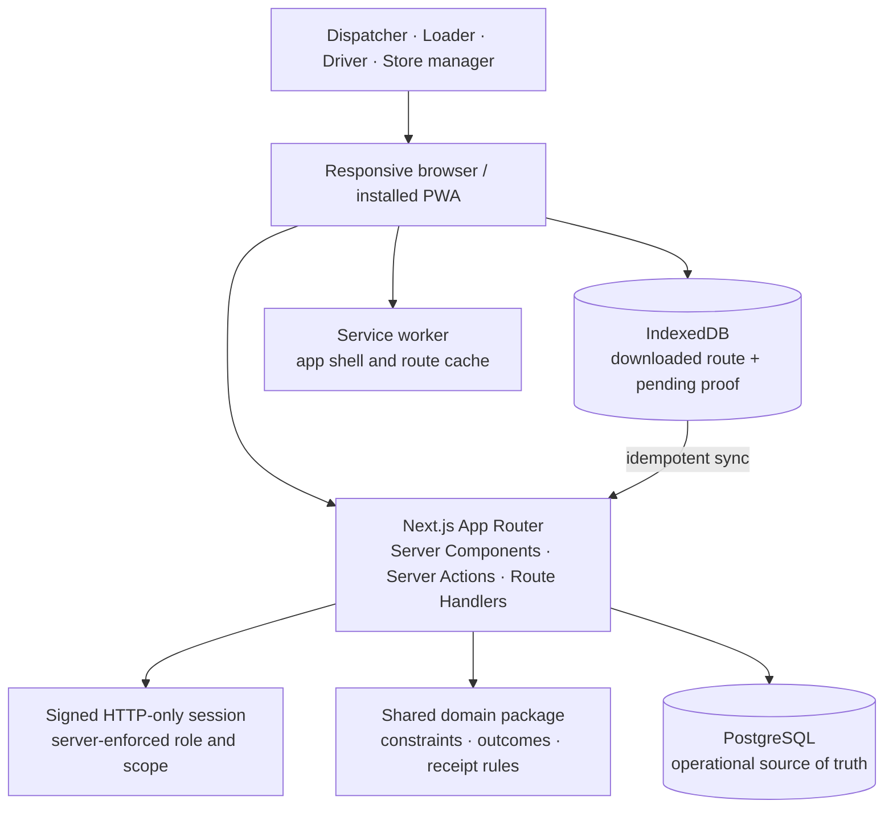

# Waypoint architecture

Waypoint is a Next.js App Router application with a PostgreSQL source of truth and an IndexedDB offline boundary for driver work. The public deployment targets Vercel with a managed PostgreSQL provider. The reproducible judge environment uses the same application against the PostgreSQL container in `docker-compose.yml`.

## Application boundaries

- `apps/web`: routes, page composition, role shells and browser-only offline UI.
- `packages/domain`: deterministic allocation, delivery and receipt rules with no framework dependency.
- `packages/db`: schema, migration, source-data import and repeatable demonstration seed.
- `apps/web/features`: server actions and services organized around planning, loading, delivery and orders.

## Authorization

Authentication creates a signed, HTTP-only session. Each mutation verifies the server-side role before applying business rules. Seeded accounts also carry an operational scope: a depot for dispatch/loading, a vehicle for the driver, and an outlet for the store manager. Database foreign keys, uniqueness rules and transactions provide a second integrity layer.

## Offline synchronization

The driver downloads the released manifest before departure. The route snapshot and pending delivery evidence are stored in IndexedDB. Each delivery uses a stable idempotency key and the order revision observed at download time. The sync handler returns applied, duplicate, or conflict. A conflict keeps the original proof as `NEEDS_REVIEW`; it does not overwrite the shared delivery state.

## Deployment

- Local/judge: multi-stage Next.js image plus PostgreSQL and a one-shot migration/seed service.
- Vercel: `apps/web` with `DATABASE_URL`, `SESSION_SECRET`, and `APP_URL` configured as protected environment variables.
- Database migration is a controlled deployment step, never a per-request side effect.
