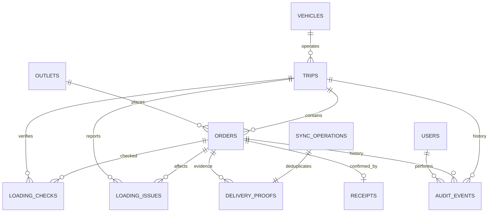

# Waypoint data model

## State ownership

| Data | Source of truth |
| --- | --- |
| Accounts and operational scope | PostgreSQL users table and signed server session |
| Orders, vehicles, trips and manifest version | PostgreSQL |
| Loading checks and discrepancies | PostgreSQL |
| Synchronized driver evidence | PostgreSQL delivery proofs |
| Store confirmation | Independent PostgreSQL receipt record |
| Downloaded route and unsynchronized proof | IndexedDB until synchronization |
| Important transitions | Append-only audit events |

## Integrity rules

- An order references one outlet and, when allocated, one trip.
- A vehicle/date/trip-number combination is unique.
- A loading check is unique per trip, order and manifest version.
- Resolving a shortfall increments the manifest version and removes the affected old check.
- One receipt exists per order, but it never replaces the delivery proof.
- Idempotency keys are unique across delivery proof and sync operation records.
- A revision mismatch creates a conflict record rather than applying an overwrite.
